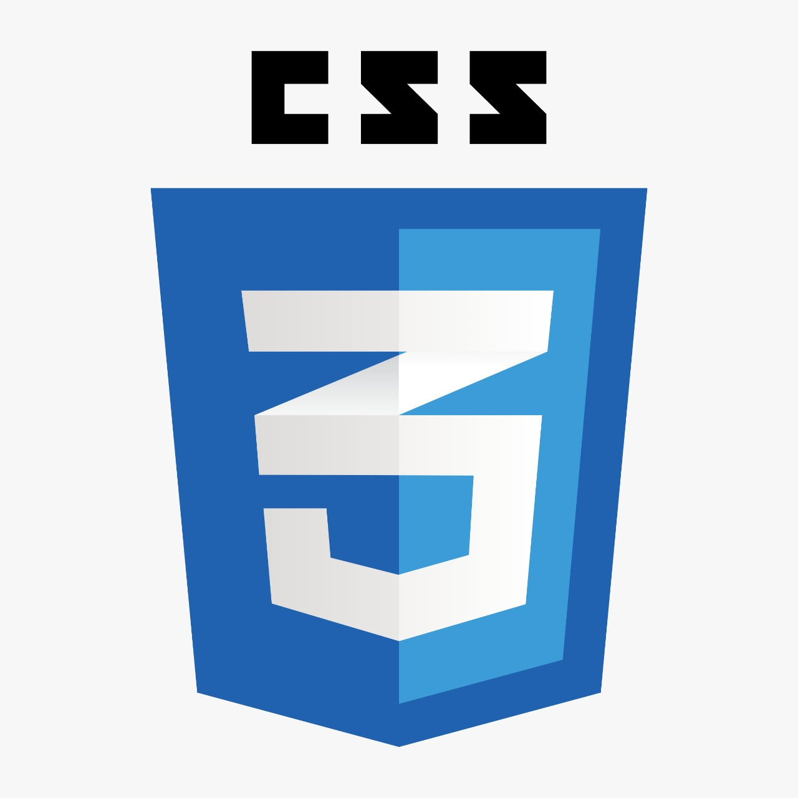
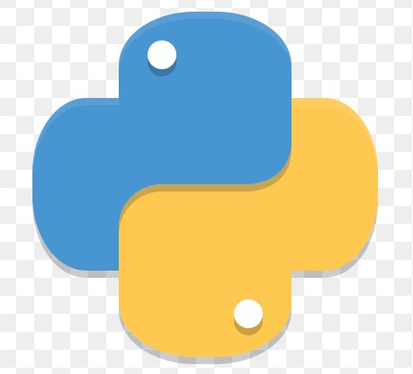
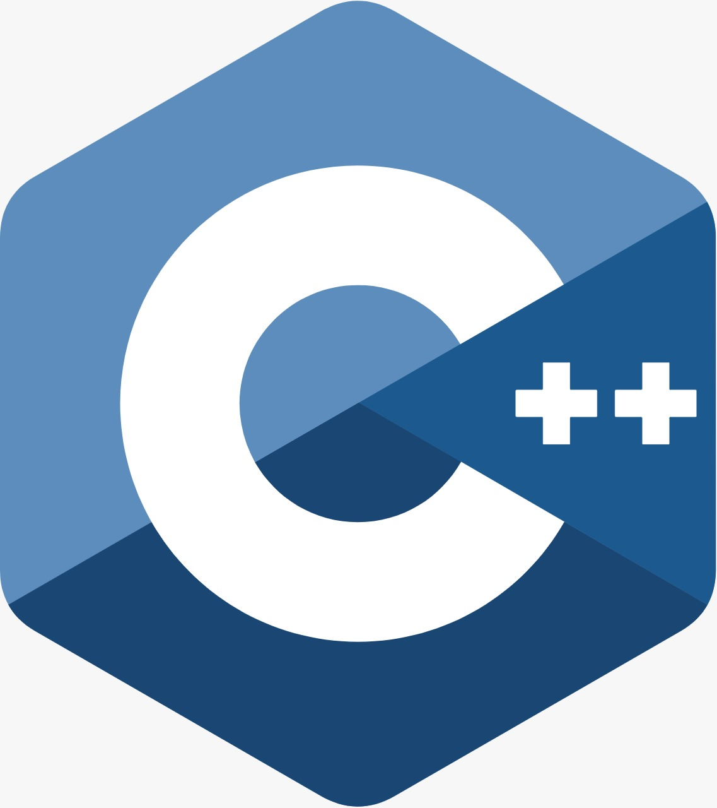

# Hello folks! 
- 👋 Hi, I’m <b>SUJAL GARG</b>.
- 👀 I’m a Web/Software Developer from India
- 🌱 I’m currently working as a Web developer and I'am an Open source enthusiast
- 💞️ I’m looking to collaborate in C/C++, Python and web development
- 📫 You can reach me @ sujalgarg94@gmail.com
 

 
 

 

## TECH STACK
 &nbsp;&nbsp;  &nbsp; &nbsp; &nbsp;&nbsp;  &nbsp;&nbsp;  &nbsp;&nbsp;  &nbsp;&nbsp; &nbsp; &nbsp; &nbsp;&nbsp; &nbsp; &nbsp; &nbsp; &nbsp;  &nbsp;&nbsp;  &nbsp; &nbsp; &nbsp; &nbsp;

# Github Activity

# Languages Used

